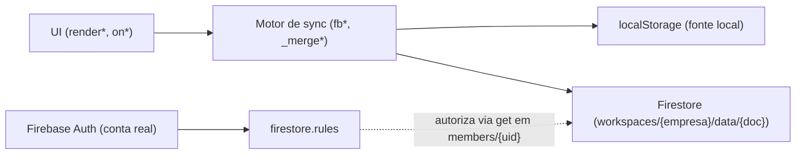
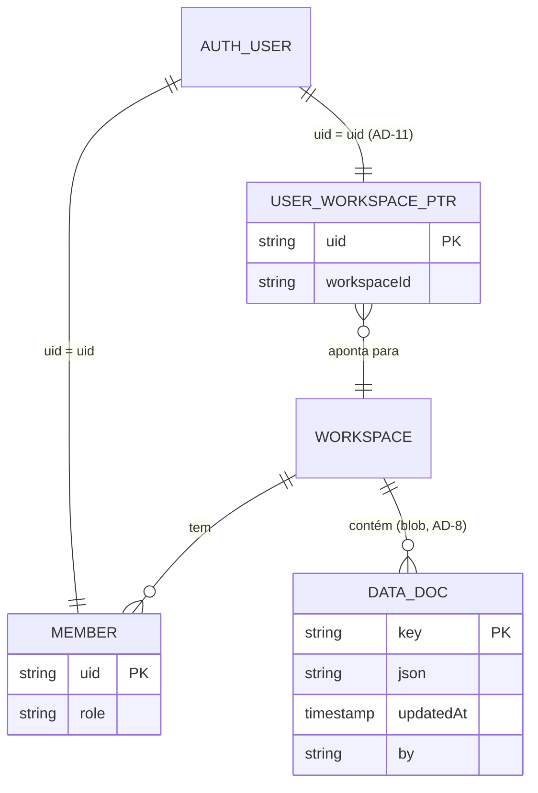

# Architecture Spine — MAPPO — Pivô Multi-Tenant

> ✅ As 7 stories de `_bmad-output/specs/spec-mappo/stories.yaml` estão implementadas e publicadas. A pré-condição original (OQ-1, regras publicadas em produção não confirmadas) foi resolvida na Story 1 — as regras encontradas de fato eram `allow read, write: if true`, corrigidas e testadas no Emulator Suite antes de publicar.

## Design Paradigm

**Local-first monolith**: um único `index.html` (HTML+CSS+JS, sem build, sem framework) onde `localStorage` é a fonte de verdade local e o Cloud Firestore é a camada de sincronização, reconciliada por um motor de merge próprio (por item, por campo, por folha, listas append-only — não CRDT formal, mas o mesmo espírito: cada tipo de dado sabe resolver seu próprio conflito). Este paradigma é ratificado, não escolhido — é o que já existe e funciona; nada aqui propõe reescrevê-lo.

Não há diretórios/módulos — o arquivo único se organiza por **zonas delimitadas por comentário-banner** (convenção já existente, ratificada):

| Zona (banner no código) | Responsabilidade |
| --- | --- |
| `MAPPO — Sincronização em nuvem (Firebase)` | `fbInit`, `fbBoot`, `initSync`, `fbPush`/`_doPush`, `_gravarMesclado`, merge engine |
| `RENDER DE VIEWS` | Renderização de tela por perfil (gestor/técnico) |
| `GESTÃO DE TÉCNICOS (Configurações)` | Cadastro/edição de técnicos |
| `VRF — estrutura de dados de obra` | `VRF_FASES` e o checklist do Ramo Refrigeração/Climatização |
| `PÁGINA PÚBLICA` | `iniciarModoPublico`, `_pubOuvirToken`, payloads públicos |
| `MODAIS` | Componentes de modal reutilizados por todas as telas |

Prefixos de nome carregam significado e são o único mecanismo de encapsulamento que existe — preservar:
- `fb*` — cruza a fronteira com o Firestore.
- `_*` — helper interno, não chamado de fora da sua zona.
- `SCREAMING_SNAKE` — constante de módulo (`WORKSPACE`, `VRF_FASES`, `SYNC_KEYS`).
- `camelCase` — estado de execução e funções de UI.

## Invariants & Rules



### AD-1 — Isolamento multi-tenant é o caminho, nunca um filtro

- **Binds:** FR-3, FR-4
- **Prevents:** alguém introduzir um `where('workspaceId','==',...)` sobre uma coleção plana — o app hoje não usa nenhuma query (`firestore.indexes.json` vazio, confirmado no código), e isso deve continuar assim.
- **Rule:** todo dado de tenant vive em `workspaces/{workspaceId}/data/{doc}`. `workspaceId` nunca é um campo filtrado em query — é sempre o próprio caminho da coleção. Nenhuma leitura cruza workspaces.

### AD-2 — Autorização no servidor via documento de membership, não custom claims

- **Binds:** FR-2, FR-4
- **Prevents:** introduzir Cloud Functions/custom claims (infra nova, exige plano Blaze) ou confiar em qualquer campo de perfil enviado pelo cliente.
- **Rule:** cada workspace tem `workspaces/{workspaceId}/members/{uid}` com `{role: 'gestor'|'tecnico'}`. `firestore.rules` autoriza lendo esse documento via `get()`. Nenhum documento em `.../data/{doc}` é confiável para decidir permissão. Escrita em `members/{uid}` é ela própria protegida por regra, com predicado concreto: `allow create` só passa se (a) o autor já é `gestor` do workspace (`get()` no próprio `members/{autor.uid}`), OU (b) a subcoleção `members` do workspace está vazia — bootstrap do primeiro `gestor`, verificável em regra sem contar documentos (checa a ausência do próprio doc do `uid` sendo criado E de um marcador `workspaces/{workspaceId}` com `criado:true` que o cadastro seta atomicamente junto). Um `tecnico` nunca escreve seu próprio documento de membership, nem o de ninguém. `[ADOPTED]`

### AD-3 — `WORKSPACE` vira estado de sessão, resolvido uma vez, não parâmetro por chamada

- **Binds:** todas as funções que tocam o Firestore (hoje 6 pontos de chamada + a declaração — `index.html:924,1160,1427,1452,1468,4801,4892`)
- **Prevents:** refatoração ampla que passa `workspaceId` como argumento explícito por 17+ funções — contra a política de mudança cirúrgica.
- **Rule:** `WORKSPACE` deixa de ser `const` fixa e vira variável de módulo (`let`) resolvida uma única vez: dentro do `onAuthStateChanged` de `fbInit`, depois que o `uid` autentica E o documento de membership (AD-2) resolve — antes de `initSync()`/`fbBoot()` prosseguir. Estende a mesma garantia que `fbReady` já impõe (nenhuma leitura/escrita antes do auth confirmar — corrigido nesta mesma sessão, commits `2702e80`/`9d264d5`): agora `fbReady` só vira `true` depois que **auth + membership + workspace** resolverem juntos, não só auth.

### AD-4 — Templates de Checklist por Ramo são código, clonados como dado no cadastro

- **Binds:** FR-6, FR-7, FR-8
- **Prevents:** modelar uma coleção Firestore de templates (`ramoTemplates`) agora, antes de existir onboarding self-service que justifique dado editável sem deploy.
- **Rule:** cada Ramo do MVP é uma constante JS no mesmo padrão de `VRF_FASES` (`index.html:1633`). No cadastro, o valor da constante é clonado para dentro do workspace novo como um documento comum (segue AD-5/AD-8, não um formato especial). Depois de clonado, a cópia do workspace é autônoma — editar não afeta a constante-fonte nem outros workspaces. Um workspace tem exatamente um Ramo (escolhido uma vez no cadastro); o checklist clonado vive numa única chave genérica em `SYNC_KEYS` (ex.: `mappo_checklist_config`) — nunca uma chave por Ramo dentro do mesmo workspace, mesmo que o catálogo de Ramos cresça. `[ADOPTED]`

### AD-5 — Motor de merge não muda; multi-tenancy é só um parâmetro de caminho

- **Binds:** FR-16, toda sincronização
- **Prevents:** confundir "adicionar multi-tenant" com "redesenhar merge" na mesma mudança.
- **Rule:** `SYNC_KEYS`, `ITEM_LISTS`, `LEAF_MAPS`, `APPEND_LISTS`, `MERGE_MAPS` e as funções `_mergeItens`/`_mergeLeafs`/`_mergeLista`/`_mergeMapa` mantêm assinatura e comportamento idênticos. A única mudança que chega nessa camada é a origem dinâmica de `WORKSPACE` (AD-3).

### AD-6 — Identidade: uma conta Firebase Auth por pessoa; membership é o elo, não o nome

- **Binds:** FR-1, FR-2
- **Prevents:** continuar casando "quem é quem" por nome/string, como hoje (`mappo_tecnicos` não tem `uid` — a auditoria já apontou isso como risco de migração).
- **Rule:** registros de `mappo_tecnicos` ganham um campo `uid` (Firebase Auth), que é a chave de junção com `members/{uid}` (AD-2). O campo `senha` é aposentado — nunca populado para registro novo. `uid` é um campo adicional, não uma nova chave de merge: `ITEM_LISTS['mappo_tecnicos']` continua identificado por `nome` (AD-5, inalterado) — dois técnicos com nome igual no mesmo workspace seguem colidindo no merge, limitação pré-existente que esta espinha não resolve (ver Deferred). Migrar os registros existentes da Elite Ar (nome → uid, texto plano → hash/nenhuma senha local) é item de dado, não resolvido por esta espinha (ver Deferred).

### AD-7 — Nenhum backend novo neste MVP

- **Binds:** all
- **Prevents:** resolver qualquer requisito deste PRD com Cloud Functions, um serviço HTTP próprio, ou qualquer processo servidor além do Firestore + suas regras.
- **Rule:** toda autorização vive em `firestore.rules`; toda lógica de negócio vive no cliente. Nenhuma pasta `functions/`, nenhum bloco `functions` em `firebase.json`, nesta fase. `[ADOPTED — confirmado por varredura: zero uso de customClaims/getIdTokenResult/firebase.functions/httpsCallable no código atual]`

### AD-8 — Só `members/{uid}` usa campos reais; todo o resto continua no envelope JSON-blob

- **Binds:** FR-2, FR-4, toda sincronização
- **Prevents:** (a) codificar `members/{uid}` como `{json: "..."}` — `firestore.rules` não consegue fazer `JSON.parse` para checar `role`, então isso quebraria AD-2; (b) "por consistência", tentar migrar dado comum (OS, checklist, etc.) para campos reais — isso quebraria o motor de merge (AD-5), que opera sobre blob JSON parseado no cliente.
- **Rule:** `workspaces/{workspaceId}/members/{uid}` é o único tipo de documento novo com campos reais no topo (`role`, `convidadoPor`, etc.), porque as regras precisam lê-lo diretamente. Todo outro documento — incluindo o checklist clonado (AD-4) — usa o envelope existente `{json, updatedAt, by}` e passa pelo motor de sync (AD-5) sem exceção.

### AD-9 — Toda captura de foto passa por uma função de compressão única

- **Binds:** FR-10
- **Prevents:** exatamente a regressão que FR-10 existe para fechar — um novo ponto de captura de foto (equipamento, checklist, o que vier) gravar direto do `FileReader` sem redimensionar, do jeito que `onCheckFoto`/`onEquipFoto` faziam antes desta correção.
- **Rule:** nenhum ponto de captura de imagem chama `set()`/gravação com o resultado bruto do `FileReader`. Todo caminho de foto passa pela mesma rotina de compressão (`canvas` + JPEG, o padrão já usado no checklist VRF) antes de qualquer persistência local ou remota.

### AD-10 — Expiração de Link Público é um campo checado em dois lugares, não um TTL do Firestore

- **Binds:** FR-14
- **Prevents:** depender só de regra de segurança para "esconder" um link expirado (Firestore não tem TTL nativo condicional a esse tipo de lógica de negócio) ou só do cliente (que pode ser contornado lendo o documento direto).
- **Rule:** o documento `pub_{token}` ganha um campo `expiraEm` (timestamp). A UI da Página Pública checa `expiraEm` antes de renderizar dado (comportamento hoje). `firestore.rules` também nega leitura quando `resource.data.expiraEm < request.time` — a checagem existe nos dois lugares, cliente para UX, regra para não depender só do cliente. Revogação manual (botão do Gestor) zera `expiraEm` para "agora", reaproveitando o mesmo mecanismo.

### AD-11 — Descoberta de workspace por uid é um lookup global, separado do membership

- **Binds:** FR-1, FR-2, FR-3
- **Prevents:** o buraco que dois revisores independentes encontraram no mesmo lugar: `members/{uid}` vive DENTRO de um workspace, mas nada resolve qual workspace consultar a partir só do `uid` — sem isso, AD-2/AD-3 não têm como executar na prática.
- **Rule:** existe uma coleção de topo, fora de qualquer workspace, `userWorkspaces/{uid}` → `{workspaceId: string}`. Regra: cada `uid` só lê o próprio documento (`request.auth.uid == uid`). Uma pessoa pertence a exatamente um workspace (`[ASSUMPTION]` — o produto não modela hoje uma pessoa em duas empresas ao mesmo tempo; se isso mudar, é uma nova AD, não uma extensão desta). Sequência de boot correta: `uid` autentica → lê `userWorkspaces/{uid}` → obtém `workspaceId` → lê `workspaces/{workspaceId}/members/{uid}` → obtém `role` → `WORKSPACE` (AD-3) é setado → `fbReady=true`.
- **Cache e falha:** `workspaceId` e `role` resolvidos são gravados em `localStorage` (mesmo padrão já usado por `session` hoje). Boot subsequente sem rede reusa o valor em cache sem revalidar — prioriza continuidade offline sobre revalidação a cada abertura, coerente com o paradigma local-first. Quando a rede volta, a próxima resolução bem-sucedida sobrescreve o cache. Uma pessoa removida de um workspace enquanto offline mantém acesso local até o próximo boot com rede — risco aceito, não um bug desta espinha (mesma característica que qualquer app offline-first tem hoje).

### AD-12 — Sanitização contra XSS é uma função única, sem bypass — mesmo formato de risco que AD-9

- **Binds:** FR-15
- **Prevents:** exatamente a falha que gerou o risco original (63 ocorrências de `innerHTML=` no código, escape aplicado de forma inconsistente) se repetir: um novo ponto de renderização esquecer o escape.
- **Rule:** todo dado de usuário (nome, endereço, observação, rótulo) que entra em `innerHTML` passa por uma única função de escape compartilhada antes da interpolação — nunca escape ad-hoc por chamada. A função de escape é a mesma para a página pública e para o app autenticado; não há dois caminhos de sanitização.

## Consistency Conventions

| Concern | Convention |
| --- | --- |
| Naming (entidades, coleções, eventos) | `workspaces/{workspaceId}/data/{key}` para dado sincronizado (blob); `workspaces/{workspaceId}/members/{uid}` para autorização (campos reais). `workspaceId` é sempre o identificador do cadastro da Empresa Contratante (ex.: `climafrio`), nunca um nome livre. |
| Dados & formatos | Envelope padrão de documento sincronizado: `{json: <string>, updatedAt: serverTimestamp(), by: <nome>}` — inalterado. Membership: `{role: 'gestor'\|'tecnico', ...}`, campos reais, nunca envelope. |
| Estado & cross-cutting (mutação, erros, auth) | Nenhuma leitura/escrita no Firestore antes de `fbReady` (agora: auth + membership + workspace resolvidos — AD-3/AD-11). Erros de auth logam `e.code` e `e.message` (padrão já em uso, `index.html:1107`). `catch` nunca vazio. Nenhuma dependência nova sem aprovação explícita (`AGENTS.md`). Consentimento de GPS ao Vivo (FR-12) é persistido por pessoa (mesmo registro de membership/local do uid) — perguntado uma vez, não a cada ativação; reaberto só se o texto do consentimento mudar. |

## Stack

*Seed — nada novo introduzido (AD-7); versões conforme já pinadas no código hoje.*

| Name | Version |
| --- | --- |
| Firebase JS SDK (compat: app, auth, firestore) | 10.12.2 |
| Leaflet | 1.9.4 |
| jsPDF | 2.5.1 |
| Service Worker / Web App Manifest (APIs de plataforma, não dependência) | padrão web, sem versão a pinar |

## Structural Seed

```text
{project-root}/
  index.html          # app inteiro — zonas por banner-comentário (ver Design Paradigm)
  manifest.json        # NOVO — FR-17, ícones já existentes (icon-192.png, icon-512.png)
  sw.js                 # NOVO — FR-17, Service Worker mínimo (cache do shell)
  firestore.rules       # regras: userWorkspaces/{uid} + workspaces/{wsId}/data/{doc} + workspaces/{wsId}/members/{uid}
  firestore.indexes.json # permanece vazio — nenhuma query introduzida (AD-1)
```



```mermaid
sequenceDiagram
  participant U as Usuário
  participant App as index.html (fbInit)
  participant Auth as Firebase Auth
  participant FS as Firestore
  U->>App: abre o app
  App->>Auth: signInAnonymously() [publico] ou login real [gestor/técnico]
  Auth-->>App: onAuthStateChanged(user)
  App->>FS: get userWorkspaces/{uid}  (AD-11 — descobre o workspace)
  FS-->>App: workspaceId
  App->>FS: get workspaces/{workspaceId}/members/{uid}  (AD-2)
  FS-->>App: role confirmado
  App->>App: WORKSPACE = workspaceId; fbReady = true  (AD-3)
  App->>FS: initSync() — pull/seed/listen (AD-5, inalterado)
```

## Capability → Architecture Map

| Capability / Area | Lives in | Governed by |
| --- | --- | --- |
| FR-1, FR-2 — Autenticação real, perfil por uid | Zona "Sincronização em nuvem" (`fbInit`) + novo doc `members/{uid}` + `userWorkspaces/{uid}` | AD-2, AD-3, AD-6, AD-11 |
| FR-3, FR-4, FR-5 — Isolamento e regras | `firestore.rules` + processo de Emulator Suite | AD-1, AD-2 |
| FR-6, FR-7, FR-8 — Onboarding e templates por Ramo | Novo fluxo de cadastro + constantes estilo `VRF_FASES` | AD-4, AD-8 |
| FR-9 — OS (existente, preservar) | Funções existentes de criação/execução de OS | AD-5 (motor inalterado) |
| FR-10 — Compressão de foto consistente | `onCheckFoto`/`onEquipFoto` + rotina de compressão já usada no VRF | AD-9 |
| FR-11, FR-12 — GPS e consentimento | Funções de GPS existentes + nova tela de consentimento (UI, sem impacto arquitetural) | — |
| FR-13 — Link público (existente, preservar) | Zona "Página Pública" (`iniciarModoPublico`, `_pubOuvirToken`) | AD-1 |
| FR-14 — Expiração/revogação do link | `publicarAcompanhamento` + campo novo `expiraEm` | AD-10 |
| FR-15 — Sanitização contra XSS | Todo ponto de `innerHTML` com dado de usuário (63 ocorrências mapeadas na auditoria) | AD-12 |
| FR-16 — Sincronização offline-first | Zona "Sincronização em nuvem" inteira | AD-3, AD-5, AD-8 |
| FR-17 — PWA | Novos `manifest.json` + `sw.js` | Structural Seed |

## Deferred

- **Custom claims / Cloud Functions** — só se algum dia existir necessidade real de multi-workspace por pessoa ou lógica que não dá para confiar em regras declarativas. AD-2/AD-7 seguem valendo até lá.
- **`ramoTemplates` como coleção Firestore** — faz sentido quando onboarding self-service existir (fora do MVP, PRD §6.2). Até lá, AD-4 (código) é suficiente.
- **Projeto Firebase de staging** — decisão desta sessão: não agora, Emulator Suite cobre o MVP. Revisitar se o piloto crescer além de poucas empresas.
- **Migração de dados existentes** (`mappo_tecnicos` da Elite Ar: nome→uid, retirar senha em texto plano) — é migração de dado real, exige backup e plano de rollback (`AGENTS.md`) antes de tocar; não modelado aqui.
- **CI/CD pipeline, ambientes separados (dev/homolog/prod)** — não modelado nesta espinha; deploy continua manual. **`git push` para `main` sozinho não é suficiente** — `CLAUDE.md` proíbe commit direto em `main`; o mecanismo de branch/revisão antes do push é política já registrada em `AGENTS.md`/`CLAUDE.md`, não uma AD desta espinha.
- **Firebase Storage para fotos** — MVP entrega só o aviso de falha >1MB (FR-16, ver AD-9 para a compressão); migração completa é PRD §6.2, fora de escopo.
- **TWA/Capacitor, Play Store, iOS nativo** — PWA (FR-17) é o único empacotamento desta espinha; o resto é evolução, PRD §6.2.
- **Recuperação de senha self-service, login social** — PRD §6.2/`[NOTE FOR PM]`; FR-1 desta espinha cobre só conta real e-mail/senha.
- **Autorização por recurso dentro do mesmo workspace** (ex.: um técnico só escrever em OS atribuída a ele, não em qualquer OS do workspace) — as ADs desta espinha autorizam por papel (gestor/técnico) e por workspace, não por dono do recurso. Não é requisito do PRD hoje; fica nomeado aqui para não ser inventado silenciosamente por uma implementação e divergir de outra.
- **Duplicidade de nome em `mappo_tecnicos` no mesmo workspace** — limitação pré-existente do merge por `nome` (AD-6), não resolvida por esta espinha.
- **Verificar vigência das versões pinadas** (Firebase compat SDK 10.12.2 — camada legada de transição, não o caminho novo do SDK modular; jsPDF 2.5.1 é um patch antigo dentro do 2.x) antes do rollout multi-tenant — nenhuma foi checada contra a web nesta sessão (sem acesso à internet); nenhuma migração é implicada por esta espinha (AD-7), só uma verificação de segurança/manutenção pendente.
- **Firebase App Check** — protege Firestore/Auth contra bots e uso fora do app real (hoje as chaves públicas do Firebase, visíveis no código-cliente, permitem qualquer um bater direto na API). Pronto para o piloto — maior custo-benefício, não muda nenhuma AD existente. Verificado ativo/atual na web (2026-08-24).
- **Backup automático do Firestore** (exportação agendada, `gcloud firestore export`) — hoje só existe a exigência de backup manual antes de migração (`AGENTS.md`). Pronto para o piloto, antes de acumular dado de cliente real.
- **Firebase Crashlytics / Cloud Logging** — hoje o único log é `fbLog`, interno ao app (painel de diagnóstico); ninguém sabe de um erro sem o cliente reclamar. Pronto para o piloto.
- **Firebase Hosting clássico** (não "App Hosting", que mira Next.js/SSR e não serve pra um app estático) substituindo GitHub Pages — unificaria deploy e banco no mesmo console; os "preview channels" resolveriam o item de staging acima sem projeto Firebase separado. Cresce depois — GitHub Pages funciona por ora.
- **MFA para o Gestor** (hoje só e-mail/senha) — conta de gestor tem acesso a todo o dado do workspace. Cresce depois, quando o piloto passar de poucas empresas conhecidas.
- **Firebase Data Connect** (Postgres gerenciado) só para analytics/relatórios cross-empresa, nunca para o dado operacional — trocar o banco operacional quebraria o motor de merge (AD-5/AD-8), desenhado especificamente pro formato blob do Firestore. Cresce depois, só se/quando essa necessidade existir de verdade.
- **Cloud Run** (containers gerenciados, não Kubernetes) — só se/quando surgir lógica que `firestore.rules` não consegue expressar (cobrança/webhooks, PDF server-side); contradiz o AD-7 atual, então seria decisão consciente de abrir esse AD quando chegar a hora, não adição silenciosa. Não se aplica hoje — app é 100% serverless, sem servidor pra conter.
- **Firebase Remote Config** para trocar constantes (`RAMO_TEMPLATES` etc.) sem redeploy — mudança de padrão não trivial (constante-como-código é o padrão ratificado em AD-4). Cresce depois, mencionado, não recomendado agora.
- **Firebase AI Logic/Genkit** — descartado, sem funcionalidade de IA no roadmap do produto hoje.
